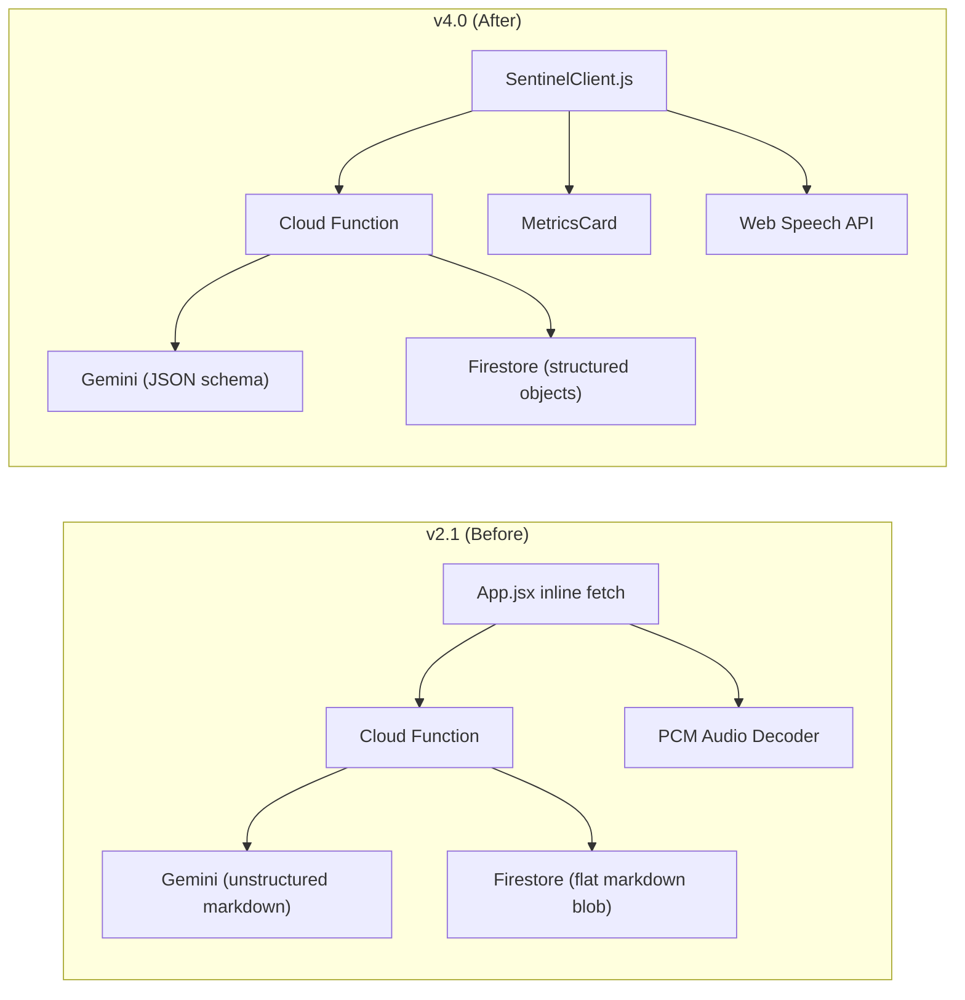

# Sentinel Engine v4.0 — Walkthrough

## Summary

Complete architectural overhaul from legacy patterns (flat markdown data, unstructured inference, inline fetch) to a production-hardened, schema-validated GCP-native infrastructure.

---

## Changes Made

### Phase 1: Backend — Structured JSON Inference

render_diffs(file:///d:/Documents/Sentinel%20Engine/functions/index.js)

**Key changes:**
- **Removed** `AUDIO` modality and `speechConfig` from Gemini configuration (incompatible with `gemini-2.0-flash`)
- **Added** `responseMimeType: 'application/json'` + `responseSchema` to enforce machine-readable output
- **Defined** `LOGISTICS_RESPONSE_SCHEMA` with typed fields: `narrative` (markdown), `metrics[]` (label/value/trend/confidence), `confidence` (0-1), `sources[]`
- **Updated** system prompt to instruct Gemini to populate the schema fields
- **Added** JSON parse fallback — if Gemini returns non-JSON despite schema constraint, wraps raw text in expected structure
- **Removed** `audioData` from the response payload

---

### Phase 2: Data Pipeline — Schema-Validated Firestore

render_diffs(file:///d:/Documents/Sentinel%20Engine/functions/seed-firestore.js)

**Key changes:**
- Replaced flat `SOURCE_ALPHA_CONTENT` markdown string with fully structured `SOURCE_ALPHA_STRUCTURED` object
- All logistics data now typed: freight indices (numeric rates, WoW %), port congestion (vessel counts, wait times, severity enums), chokepoints, BDI, air freight, risk matrix
- Firestore document stores dual format:
  - `content`: JSON-serialized string for LLM prompt injection
  - `structured`: Raw JS object for programmatic queries and BigQuery export
- Added `_config` metadata document for system introspection

---

### Phase 3: Frontend — Headless Client & Structured UI

#### New: [SentinelClient.js](file:///d:/Documents/Sentinel%20Engine/src/SentinelClient.js)

- Framework-agnostic API abstraction class
- `query(text)` → returns `{ narrative, metrics, confidence, sources }`
- `healthCheck()` → non-token-consuming health probe using auth/validation gates
- `SentinelError` → custom error class with `code`, `requestId`, `httpStatus`
- Auth token acquisition handled internally via `getAuth().authStateReady()`

#### Modified: [App.jsx](file:///d:/Documents/Sentinel%20Engine/src/App.jsx)

render_diffs(file:///d:/Documents/Sentinel%20Engine/src/App.jsx)

**Key changes:**
- **New `MetricsCard` component** — renders structured metrics with trend-aware color coding (↑ green, ↓ red, → amber)
- **`QueryTerminal`** now uses `SentinelClient.query()` instead of inline `fetch()`
- **Structured response rendering** — messages carry `metrics[]`, `confidence`, `sources[]` alongside `narrative`
- **Confidence badge** shown per response with percentage
- **Source attribution** displayed in response footer
- **PCM audio code deleted** — removed AudioContext, base64 decoding, 16-bit PCM parsing
- **Voice simplified** to Web Speech API only (cross-browser, no model dependency)
- **App sync pipeline** refactored to use `SentinelClient.healthCheck()`

---

### Phase 4: Security Hygiene

| File | Change |
|---|---|
| [.env](file:///d:/Documents/Sentinel%20Engine/.env) | Purged `VITE_GEMINI_API_KEY` (leaked credential) |
| [functions/package.json](file:///d:/Documents/Sentinel%20Engine/functions/package.json) | Removed `@google-cloud/vertexai` and `@pinecone-database/pinecone` |

---

## Architecture Diagram (Before → After)



## Verification

> [!IMPORTANT]
> Run these commands to validate the deployment:

### Install cleaned dependencies
```bash
cd functions && npm install
```

### Seed Firestore with structured data
```bash
cd functions && node seed-firestore.js
```

### Start frontend dev server
```bash
npm run dev
```

### Deploy Cloud Function
```bash
cd functions && npm run deploy
```
